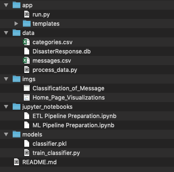
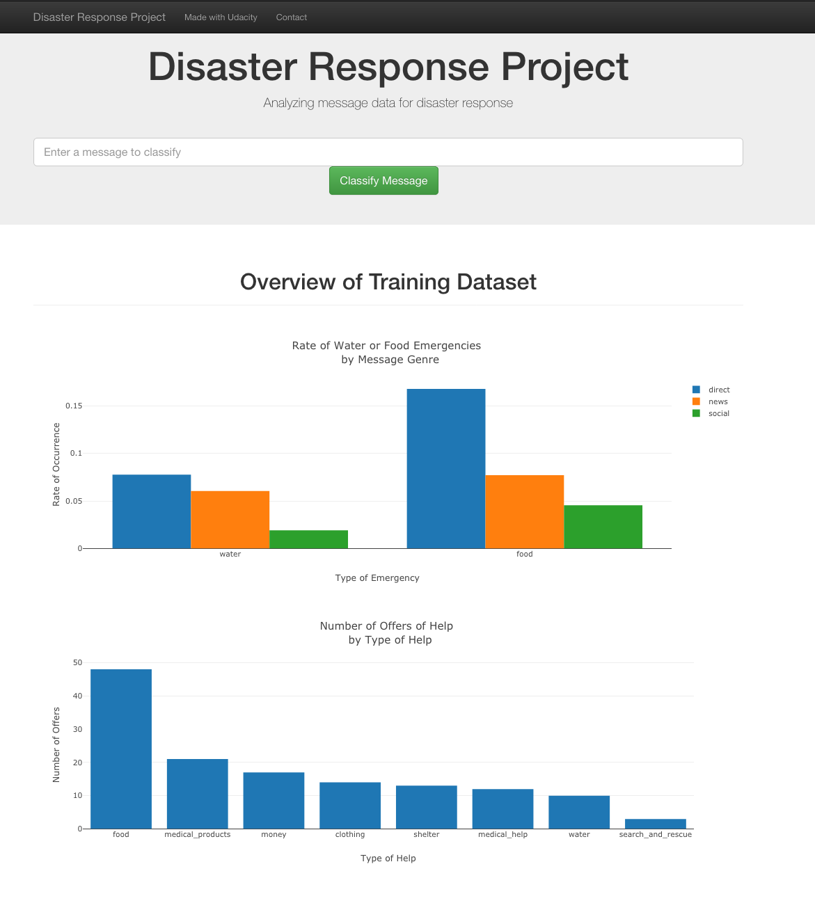

# The Disaster Response Machine Learning Pipeline

## Project Brief
Rescue and Aid Organizations receive a deluge of communication, and this makes it hard for them to separate legitimate requests for assistance from less urgent messages. This project builds a text classification pipeline using machine learning and NLP techniques to automate the process of classifying messages as either requests for help or some other kind of message. The pipeline is embedded into a web application that allows users to classify text messags on the fly.

## Installation
In order to install the files for this application to your local machine, open a terminal (or use GitBash in Windows) and type the following command:

`git clone https://github.com/beliu/disaster_response_pipeline.git`

The files will download to your machine. The file structure will look like this:

## Usage
There are main groups of scripts: data processing, training and evaluating a model, and running the web application.

### Data Processing
The `data` folder contains files for reading in text messages and categories, and converting them into a form usable for the training model. You can run the data processing yourself by going into the `data` folder and issuing the following command:

`python process_data.py messages.csv categories.csv DisasterResponse.db`

The file `process_data.py` runs the script. The next input is the name of the csv file with the text messages. Then, input the name of the file with the different message categories. Finally, input the name of the SQLite database to which the data will be saved. If the database name already exists then it will be overwritten. Of course, the above is just an example and you can substitute any filename you wish, as long as the file exists in the `data` folder

### Training and Evaluating the Model
The `models` folder contains the files for training a model on the processed data and evaluating it using an F1-Score. I experimented with and built the ML pipeline in a Jupyter Notebook named `ML Pipeline Preparation.ipynb` inside the `jupyter_notebooks` folder. I selected an AdaBoost Classifier to catageorize the messages based on its higher performance (f1-score is the metric) compared to a Random Forest or a Multinomial Naive Bayes Classifier. I optimized the parameters for the classifiers by using `GridSearchCV` over an array of different parameter types and values. The optimal ones were selected for the AdaBoost classifier and used in the final pipeline for the web app.

In order to run the machine learning pipeline, navigate to the `models` folder and type the following command to the terminal:

`python train_classifier.py ../data/DisasterResponse.db classifier.pkl`

The `train_classifier.py` runs the script. The second input is the location of the SQLite database from the data processing step. The final input is the name of the pickle file you want to save the classifier to.

### Running the Web App
The `app` folder contains the files to load the model into an interactive webb application that you can access with a browser. The `run.py` uses Flask to construct a web page and then react to user input. The model we trained from the previous step is loaded when the user inputs a text message and classifies the message. Multiple classifications are possible for one message and all classifications are displayed in the web app. Those that the message fall under are highlighted in green.

Another part of the `run.py` script reads in the data from the SQLite database and analyzes the data itself. The python package Plotly can take the results of the analysis and embed them into the web page's HTML code.

To run the web application, navigate to the `app` folder and type the following command to the terminal:

`python run.py`

If you get this message:

`Running on http://0.0.0.0:3001/`

then the app is successfully running. In another terminal window, run the following terminal:

`env | grep WORK`

and you will see a SPACEDOMAIN and SPACEID output. Open up your favorite browser and go to this URL:

`SPACEID-3001.SPACEDOMAIN`

where you would substitute the SPACEID and SPACEDOMAIN with the values from your terminal.

### The Web Application
When I launch my web application, I see this in the homepage:

The use would type in the message at the text bar at the top of the page and click Classify Message to see which category the message falls under. Beneath that, you will find two visualizations that summarize the dataset. One shows the rate of water and food-related emergencie messages (out of total number of messages received) based on the source of the message. The second shows that some messages are sent to offer outside help, and what the most common offers for help consists of.

Once the user types a message and clicks Classify Message, the two charts will be replaced with a list of all categories. If the pipeline classifies a message as one or more type of categories, then those will appear highlighted in green.

